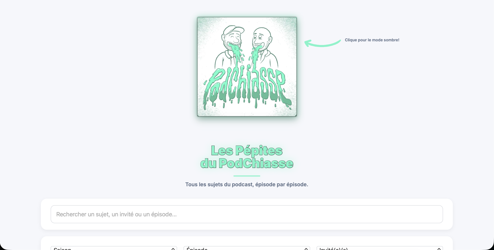
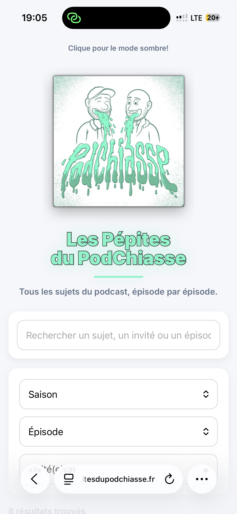

# Les Pépites du PodChiasse

Site indépendant et non officiel recensant les sujets abordés dans le podcast PodChiasse.

## Lien du site

Ajoutez ici le lien du site publié.

## Fonctionnalités

- Recherche par sujet, invité, saison ou épisode
- Filtres par saison, épisode et invité
- Mode sombre activé en cliquant sur le logo
- Interface adaptée aux ordinateurs et aux téléphones
- Mise en avant des résultats recherchés

## Avertissement

Ce site est indépendant et non officiel. Il est créé à titre amateur et n’est pas affilié au podcast PodChiasse ni à ses ayants droit.

## Aperçu

### Version ordinateur

### Version mobile

